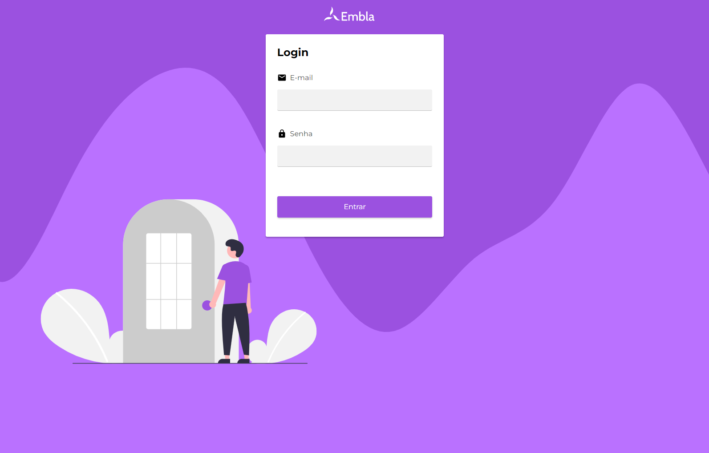

# Embla



A bank customers management web app.

## Running locally

First, install any required dependencies

```bash
  yarn install
```

Then, start the mock json-server pointing towards the db.json file

```bash
  yarn json-server-auth db.json
```

Finally, start the development server

```bash
  yarn dev
```

Then, open up [http://localhost:8000](http://localhost:8000) with your browser of choice to check out the application.

The included db.json file already includes a mock user through which you may access the application:

```bash
  email: jorge@embla.com
  password: jorge123
```
## Running tests

In order to run unit tests againts the app, you may utilize the test script

```bash
  yarn test
```


## Vercel Deploy

There is also a live Vercel deploy available at (same credentials as development environment):  
[https://embla.vercel.app](https://embla.vercel.app)

